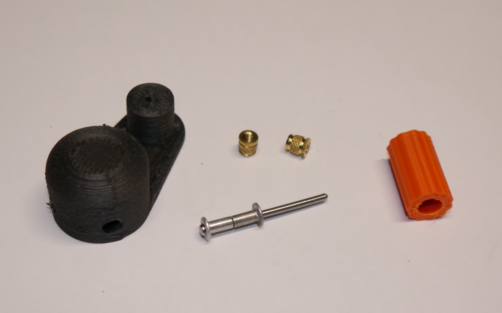
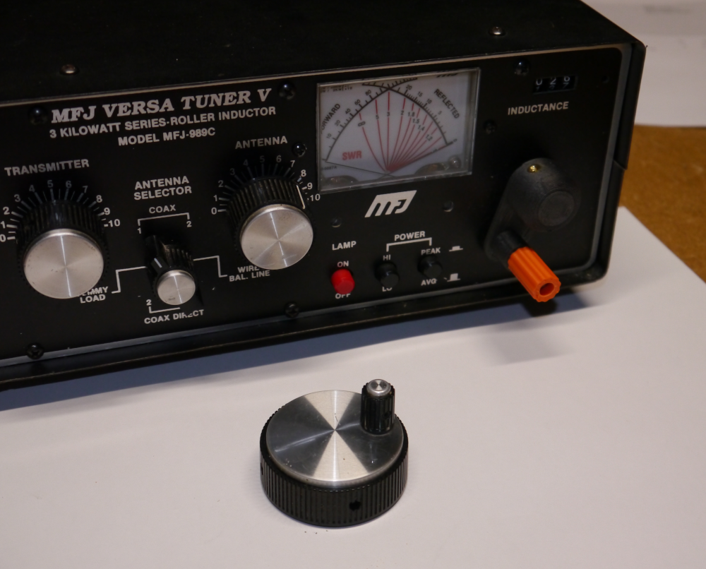

# A Crank-Style Knob for an Antenna Tuner's Rotary Inductor

I have an MFJ-989C antenna tuner...the user experience would be improved if it had a "crank"-style knob for rotary inductor control, like many newer tuners.
This repository contain STL models and SolidWorks files for a crank suitable for any control with a 1/4" shaft.

## Assembly

Print the STL files in the '/models' directory. I used `eSun ePA-CF` filament (carbon-fiber nylon) for the crank and ASA for the knob,
but presumably anything would work.

Use the parts from a couple of pop rivets to assemble the pin for the knob as shown.

Clean up the holes in the parts with a drill (0.25" for the shaft and interior of knob, 0.191" or so for the inserts, 0.080" for the pin).

Assemble and epoxy the pin in place on the underside. Use a bit of paper or similar to space the knob away from the crank until the glue cures to ensure that it spins freely.

 
Installed on the tuner, with the original knob for comparison:
 
 

## Disclaimer
You access to and use the contents of this site at your own risk.\
The author assumes no responsibility or liability for any errors or omissions in the content of this site.\
The information and models provided on this site are provided in good faith, however we make no representation  or warranty of any kind,
express or implied, regarding the accuracy, adequacy,  validity, reliability, or completeness of any information on the site.

## Contact
ac8p@proton.me
