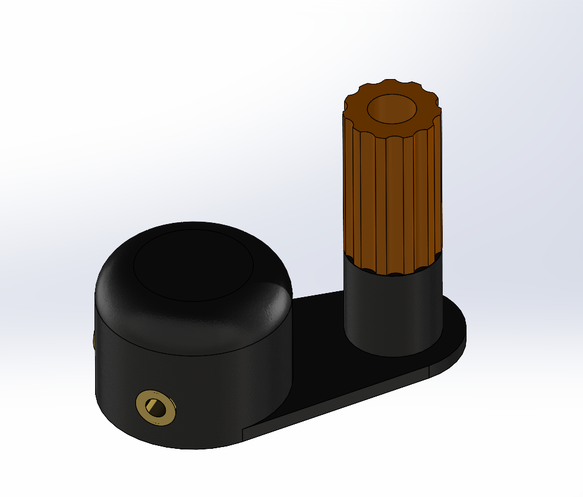

# A Crank-Style Knob for an Antenna Tuner's Rotary Inductor

This project describes the construction of homemade open-wire transmission line, along with some performance measurements.

I constructed two variants, one using an insulated 14 AWG antenna wire, and another using inexpensive 18 AWG bare stranded wire available at Home Depot and other retailers.

STL files for the 3D-printed spacers and the corresponding SolidWorks models are included.

An important caveat:  as of this writing (Sep 2024) I've constructed initial lengths of these feedlines,
but they haven't yet been exposed for any significant length of time to UV light and the effects of weather, 
so long-term reliability is yet to be proven.  
I'll update this page in the future as data becomes available.

## Description
